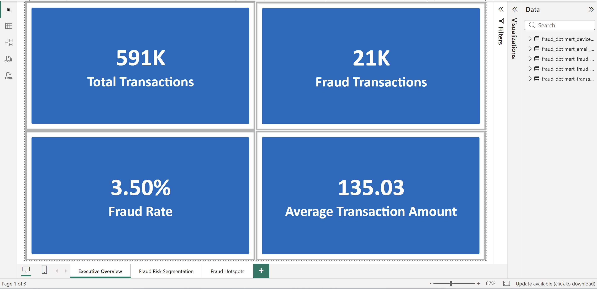
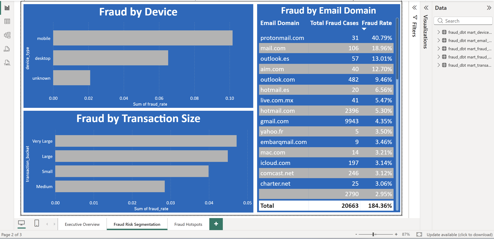
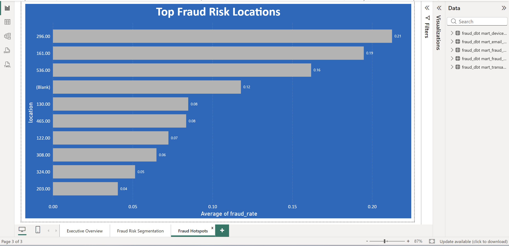

# FinTech Fraud Analytics Pipeline

End-to-end analytics engineering project analyzing fraudulent financial transactions using a modern data stack.

## Tech Stack

| Layer | Technology |
|------|-------------|
Data Processing | Python (pandas, numpy) |
Data Warehouse | PostgreSQL |
Data Transformation | dbt |
Data Quality | dbt tests |
Visualization | Power BI |
Version Control | GitHub |

# Data Source

Dataset: **IEEE-CIS Fraud Detection Dataset**

The dataset contains approximately **590,000 financial transactions** used to analyze fraudulent behavior patterns in digital payments.

Key attributes include:

- Transaction amount  
- Card network  
- Email domain  
- Device type  
- Geographic location  
- Fraud label  

---

## Architecture

IEEE Fraud Dataset
↓
Python ETL (pandas)
↓
PostgreSQL Data Warehouse
└ fraud.fact_transactions
↓
dbt Transform Layer
├ stg_transactions
├ mart_device_risk
├ mart_email_domain_risk
├ mart_transaction_buckets
└ mart_fraud_hotspots
↓
Power BI Dashboard

This pipeline follows a **modern analytics engineering architecture** where dbt transforms warehouse data into analytics-ready marts for BI consumption.

---

# Pipeline Overview

### 1 Data Ingestion

Raw fraud dataset is processed using **Python ETL scripts**.

Tasks performed:

- Data loading  
- Feature selection  
- Data cleaning  
- Export to processed dataset  

---

### 2 Data Warehouse

Processed data is loaded into **PostgreSQL**.

Main warehouse table: fraud.fact_transactions

This table stores all cleaned transaction records used by dbt models.

---

### 3 Data Transformation (dbt)

dbt is used to build a structured analytics layer.

Models include:

| Model | Purpose |
|------|---------|
| stg_transactions | Staging layer for cleaned transactions |
| mart_device_risk | Fraud risk by device type |
| mart_email_domain_risk | Fraud patterns by email domain |
| mart_transaction_buckets | Fraud distribution by transaction size |
| mart_fraud_hotspots | Locations with high fraud concentration |

---

### 4 Data Quality Validation

dbt tests ensure data integrity:

- `transaction_id` must be **unique**
- `transaction_id` must be **not null**
- `transaction_amt` must be **not null**
- `is_fraud` must contain only **0 or 1**

This ensures reliable analytics outputs.

---

### 5 Analytics Marts

Aggregated analytics tables power the BI layer and allow fast dashboard queries.

These marts enable fraud analysis such as:

- device risk segmentation  
- high-risk email domains  
- fraud transaction value distribution  
- geographic fraud hotspots  

---

# Dashboard

The Power BI dashboard contains three pages.

---

## Executive Overview

Provides high-level fraud metrics including:

- Total transactions  
- Fraud transactions  
- Fraud rate  
- Average transaction value  

---

## Fraud Segmentation

Analyzes fraud risk across transaction segments:

- Device type  
- Transaction value bucket  
- Email domain risk  

---

## Fraud Hotspots

Identifies locations with the highest fraud rates.

This helps highlight geographic regions requiring additional fraud monitoring.

---

# Key Insights

Analysis of ~590k financial transactions revealed several fraud patterns:

- **Mobile devices** showed higher fraud rates compared to desktop transactions  
- **Large-value transactions** had significantly higher fraud probability  
- Certain **email domains** appeared frequently in fraudulent activity  
- Specific **geographic locations** showed concentrated fraud hotspots  

These insights demonstrate how analytics pipelines can support **fraud detection and financial risk monitoring**.

---

# Project Structure

fintech-fraud-analytics
│
├ data
│   ├ raw
│   └ processed
│
├ src
│   └ etl
│       ├ process_ieee_data.py
│       └ load_to_postgres.py
│
├ fraud_dbt
│   └ models
│       ├ staging
│       └ marts
│
├ dashboard
│   ├ fintech_fraud_dashboard.pbix
│   └ screenshots
│
├ requirements.txt
└ README.md

---

# How to Run the Project

### 1 Clone Repository

git clone https://github.com/anandh-analytics/fintech-fraud-analytics.git

---

### 2 Install Dependencies

pip install -r requirements.txt

---

### 3 Run ETL Pipeline

python src/etl/process_ieee_data.py
python src/etl/load_to_postgres.py

---

### 4 Run dbt Models

cd fraud_dbt
dbt run
dbt test

---

### 5 Open Dashboard

Open the Power BI file:

dashboard/fintech_fraud_dashboard.pbix

---

# Future Improvements

Possible enhancements:

- Add **incremental dbt models**
- Implement **Airflow orchestration**
- Build **fraud risk ML model**
- Deploy pipeline in **cloud warehouse (Snowflake / BigQuery)**

---

# Author

Anandhageethan Thamizharasan  
Data Analytics & Data Engineering Projects

